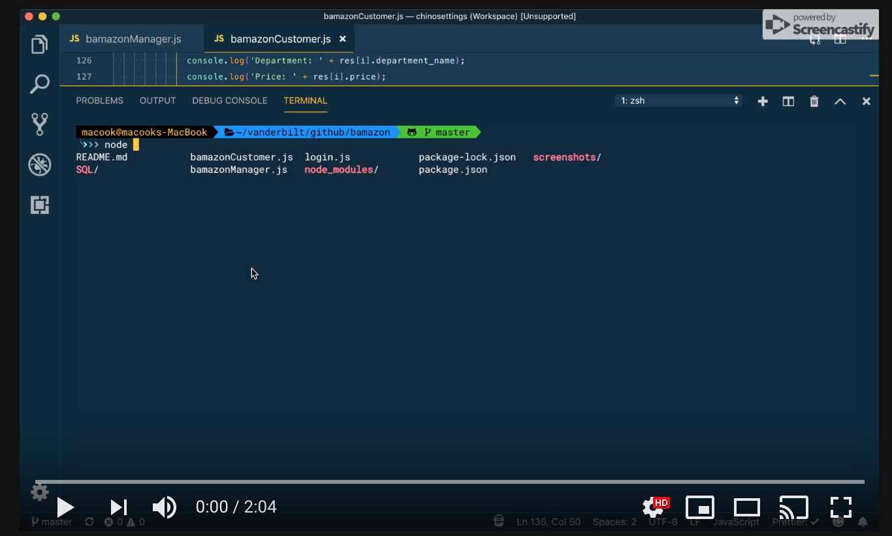

# :moneybag: BAMAZON :moneybag:

## Contributors
@rcubillo

## Technology
* Node.js
* MySQL

## Overview

This app is something similar to Amazon. The app will take in orders from customers and deplete stock from the store's inventory.

## Instructions

### Part #1: 
## Customer View.

1. MySQL Database called `bamazon`.

2. A table inside of that database called `products`.

3. The products table have each of the following columns:

   * item_id (unique id for each product)

   * product_name (Name of product)

   * department_name

   * price (cost to customer)

   * stock_quantity (how much of the product is available in stores)

4. The database contains 10 different products. 

5. A Node application called `bamazonCustomer.js`. Running this application will first display all of the items available for sale. Include the ids, names, and prices of products for sale.

6. The app prompt users with two messages.

   * The first should ask the user the ID of the product they would like to buy.
   * The second message should ask how many units of the product they would like to buy.
   
7. Once the customer has placed the order, your application should check if your store has enough of the product to meet the customer's request.

   * If not, the app should log a phrase like `Insufficient quantity!`, and then prevent the order from going through.
   
8. However, if your store _does_ have enough of the product, you should fulfill the customer's order.
   * This means updating the SQL database to reflect the remaining quantity.
   * Once the update goes through, show the customer the total cost of their purchase.

 
### Part #2: 
## Manager View.

* The app contains a new Node application called `bamazonManager.js`. Running this application will:

  * List a set of menu options:

    * View Products for Sale

    * View Low Inventory

    * Add to Inventory

    * Add New Product
    

  * If a manager selects `View Products for Sale`, the app should list every available item: the item IDs, names, prices, and quantities.

  * If a manager selects `View Low Inventory`, then it should list all items with an inventory count lower than five.

  * If a manager selects `Add to Inventory`, your app should display a prompt that will let the manager "add more" of any item currently in the store.

  * If a manager selects `Add New Product`, it should allow the manager to add a completely new product to the store.
 

## Contributing Guidelines

All contributions and suggestions are welcome! For direct contributions, please fork the repository and file a pull request.

## Contact

Developer/Full-stack Web Software Developer
   
 * E-mail: ronaldcubillo92@gmail.com
 * [Twitter](https://twitter.com/rcubillo92)
 * [LinkedIn](https://linkedin.com/in/ronald-cubillo/)

